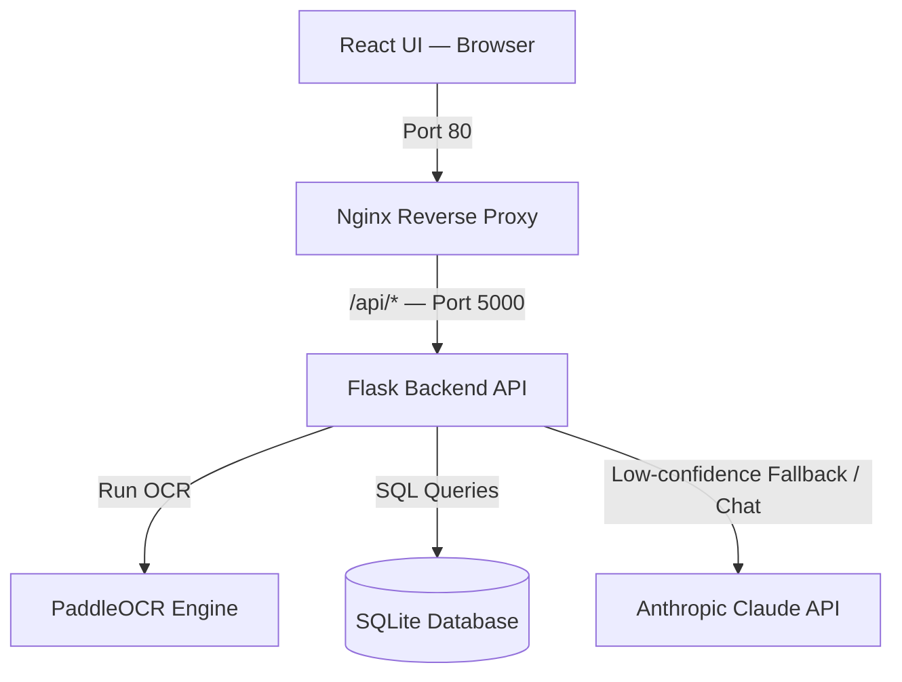

<div align="center">

# 🧾 InvoiceAI

### Intelligent Invoice Analysis Platform

[](https://python.org)
[](https://react.dev)
[](https://flask.palletsprojects.com)
[](https://docker.com)
[](https://anthropic.com)
[](LICENSE)

An enterprise-ready, AI-powered invoice analysis dashboard that ingests invoices (PDF, PNG, JPG, WebP), extracts structured data via **PaddleOCR**, runs a **deterministic fraud detection engine**, and exposes a **Claude-powered streaming chat assistant** seeded with vendor memory and transaction history.

[Features](#features) · [Architecture](#architecture) · [Quickstart](#quickstart) · [API Reference](#api-reference) · [Testing](#testing) · [Datasets](#datasets--references)

</div>

---

## Features

| Feature | Description |
|---|---|
| 📄 **Multi-format Ingestion** | Accepts PDF, PNG, JPG, and WebP invoice documents |
| 🔍 **Layout-Aware OCR** | Zone-based spatial extraction via PaddleOCR (header, meta, table, footer) |
| 🤖 **Claude Vision Fallback** | Automatically invokes Claude when OCR confidence drops below 70% |
| 🚨 **Fraud Detection Engine** | 6-rule weighted anomaly scorer covering duplicates, VAT, rounding, and math errors |
| 💬 **Streaming Chat Assistant** | SSE-based AI assistant with full invoice context and vendor memory injection |
| 🧠 **Vendor Memory** | Persists per-vendor stats (avg. amount, VAT rate, invoice count, last seen) |

---

## Architecture



The stack is fully containerized via Docker Compose. Nginx routes all `/api/*` requests to the Flask backend, while serving the React frontend on port 80.

---

## How It Works

### 1. OCR & Layout-Aware Extraction

Uploaded invoices are first converted to PIL images (PDF → `pdf2image` at 200 DPI, page 0 only), then divided into four spatial zones based on normalized Y-coordinate:

| Zone | Y Range | Target Fields |
|---|---|---|
| **Header** | < 20% | Vendor name |
| **Meta** | 20% – 35% | Invoice number, date |
| **Table** | 35% – 80% | Line items, quantities, unit prices |
| **Footer** | ≥ 80% | Totals, taxes, VAT |

Optimized regular expressions run on zone-specific text to extract dates, amounts, and invoice numbers. Spatial extraction locates labels (e.g. "Total", "VAT") and searches for the nearest numerical value within ±50px vertically.

**Claude Vision Fallback** is triggered when:
- No text can be parsed from the image, **or**
- Overall extraction confidence is `< 0.70` (fewer than 3 of 4 core fields found)

In fallback mode, the image is base64-encoded and sent to `claude-3-5-sonnet-20241022`, which returns clean structured JSON metadata.

---

### 2. Deterministic Anomaly Detection

Every uploaded invoice passes through a **6-rule weighted fraud and validation engine**. Rules fire independently; scores accumulate into a final risk score.

| # | Rule | Weight | Trigger Condition |
|---|---|---|---|
| 1 | **Duplicate Invoice** | 0.40 | Same vendor name + invoice number exists in DB |
| 2 | **Missing VAT** | 0.20 | Total > $100 and VAT is `0.0` or `null` (non-exempt vendors only) |
| 3 | **Unusually Large Amount** | 0.25 | Amount > 2.5σ above vendor average (≥ 3 prior invoices); global fallback threshold of $50,000 |
| 4 | **Missing Date** | 0.15 | Invoice date is `null` |
| 5 | **Round Number** | 0.10 | Total > $5,000 and divisible by 1,000 |
| 6 | **VAT Math Mismatch** | 0.20 | Sum of line item subtotals + VAT ≠ stated total (tolerance: $0.50) |

**Risk Thresholds:**

```
Score < 0.30  →  🟢 Low Risk
Score < 0.60  →  🟡 Medium Risk
Score ≥ 0.60  →  🔴 High Risk
```

---

### 3. AI Chat Assistant

A **Server-Sent Events (SSE)** streaming interface powers the Claude-backed chat assistant. Every request injects full context including:

- Current invoice fields and extracted line items
- All triggered anomaly rules and their weights
- Vendor memory stats: `invoice_count`, `avg_amount`, `typical_vat_rate`, `last_seen`

This allows the assistant to reason about vendor-specific patterns, flag unusual deviations, and answer nuanced questions about individual invoices.

---

## Quickstart

### Prerequisites

- [Docker](https://docs.docker.com/get-docker/) & [Docker Compose](https://docs.docker.com/compose/)
- An [Anthropic API Key](https://console.anthropic.com/)

### Local Setup

**1. Clone the repository**

```bash
git clone https://github.com/your-org/invoice-ai.git
cd invoice-ai
```

**2. Configure environment variables**

```bash
cp .env.example .env
```

Open `.env` and set your Anthropic API key:

```env
ANTHROPIC_API_KEY=sk-ant-...
```

**3. Build and start the containers**

```bash
docker compose up --build
```

**4. Open the application**

| Service | URL |
|---|---|
| Web Dashboard | [http://localhost](http://localhost) |
| Backend Health Check | [http://localhost:5000/api/health](http://localhost:5000/api/health) |

---

## API Reference

| Method | Endpoint | Description |
|---|---|---|
| `GET` | `/api/health` | Health check — returns service status |
| `POST` | `/api/invoices/upload` | Upload and analyze an invoice file |
| `GET` | `/api/invoices` | List all analyzed invoices |
| `GET` | `/api/invoices/:id` | Retrieve a single invoice with anomaly results |
| `GET` | `/api/chat/stream` | SSE endpoint — streaming chat assistant |

> Full API documentation is available at `/api/docs` when running locally.

---

## Testing

Integration and pipeline tests use synthetic PDFs to validate OCR accuracy and anomaly detection logic. Run them inside the backend container:

```bash
docker compose exec backend pytest tests/test_pipeline.py
```

To run with verbose output and coverage:

```bash
docker compose exec backend pytest tests/test_pipeline.py -v --cov=app
```

---

## Project Structure

```
invoice-ai/
├── frontend/               # React UI
│   ├── src/
│   │   ├── components/     # Dashboard, Chat, InvoiceViewer
│   │   └── App.jsx
│   └── Dockerfile
├── backend/                # Flask API
│   ├── app/
│   │   ├── ocr/            # PaddleOCR integration & zone extraction
│   │   ├── anomaly/        # 6-rule fraud detection engine
│   │   ├── chat/           # SSE streaming + Claude context builder
│   │   └── models/         # SQLite schema & vendor memory
│   ├── tests/
│   │   └── test_pipeline.py
│   └── Dockerfile
├── nginx/
│   └── nginx.conf
├── docker-compose.yml
└── .env.example
```

---

## Datasets & References

| Dataset | Description |
|---|---|
| [SROIE Receipt Dataset](https://rrc.cvc.uab.es/?ch=13) | Benchmark for scanned receipt recognition |
| [Kaggle Invoice Data Extraction](https://www.kaggle.com/datasets/humansintheloop/invoice-data-extraction) | Real-world invoice extraction dataset |
| [RVL-CDIP (Hugging Face)](https://huggingface.co/datasets/rvl_cdip) | Document type classification benchmark |

---

## Roadmap

- [ ] Multi-page PDF support (currently processes page 0 only)
- [ ] Batch invoice upload via ZIP
- [ ] Export anomaly reports as PDF/CSV
- [ ] Role-based access control (RBAC)
- [ ] Webhook support for downstream ERP integration
- [ ] Deployment to AWS / GCP (pending)

---

## Contributing

Pull requests are welcome. For major changes, please open an issue first to discuss what you would like to change. Ensure all tests pass before submitting a PR.

```bash
# Run linting and tests before submitting
docker compose exec backend flake8 app/
docker compose exec backend pytest tests/
```

---

<div align="center">

Built with ❤️ using [Anthropic Claude](https://anthropic.com), [PaddleOCR](https://github.com/PaddlePaddle/PaddleOCR), and [React](https://react.dev)

</div>
